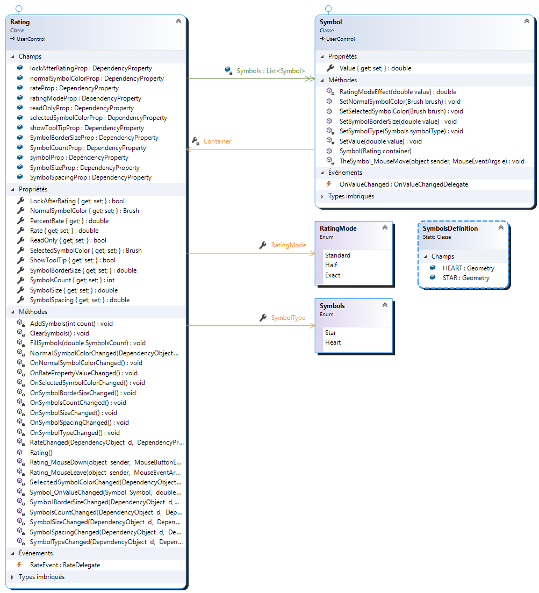

# AdmanDev.Rating

Cette librairie contient un contrôle WPF permettant à l'utilisateur d'évaluer des choses en remplissant des symboles.
Ce contrôle est entièrement personnalisable: degré de précision, lecture seule, couleur, nombre et taille des symboles...

# Démarrage rapide
- Créez un nouveau projet WPF
- Référencez le dll **AdmanDev.Rating**
- Ajoutez la référence XAML
<code>xmlns:rating="clr-namespace:Admandev.Rating;assembly=Admandev.Rating"</code>
- Ajoutez le contrôle
<code><rating:Rating Name="rating"/> </code>

# Fonctionnalités

## Degré de précision
<table>
	<thead>
		<tr>
			<th>Standard</th>
			<th>Half</th>
			<th>Exact</th>
		</tr>
	</thead>
	<tbody>
		<tr>
			<td></td>
			<td></td>
			<td></td>
		</tr>
		<tr>
		<td>Le mode standard permet de sélectionner les symboles entièrement.</td>
		<td>Le mode half permet de sélectionner la moitié d'un symbole.</td>
		<td>Le mode exact permet de sélectionner à un degré précis les symboles.</td>
	</tr>
   </tbody>
</table>

**Propriété:**
- La propriété <u>***RatingMode***  *(RatingMode)*</u> permet de choisir le mode du contrôle.

	Vous avez le choix entre 3 modes :
	- Standard (valeur par défaut)
	- Half
	- Exact

	<code><rating:Rating RatingMode="Exact"/></code>

## Choix du symbole

Vous pouvez choisir entre 2 symboles : l'étoile ou le coeur.

**Propriété:**
- La propriété <u>***SymbolType*** *(Symbols)*</u> permet de choisir le type de symbole a afficher.

	Vous avez le choix entre 2 symboles :
	- Star : affiche des étoiles *(valeur par défaut)*
	- Heart : affiche des coeurs

	<code><rating:Rating SymbolType="Heart"/></code>

## Lecture seule

Si vous activer le mode "Read only", l'utilisateur ne pourra pas modifier la note. Cette propriété est pratique si vous voulez afficher en lecture seule la note.

**Propriété:**
- La propriété <u>***ReadOnly*** *(boolean)*</u> permet d'activer le mode lecture seule.
<code><rating:Rating ReadOnly="True"/></code>
*Valeur par défaut : "False"*
- La propriété <u>***LockAfterRating*** *(boolean)*</u> permet d'autoriser ou pas l'utilisateur de modifier sa note. 
<code><rating:Rating LockAfterRating="False"/></code>
*Valeur par défaut : "True"*

## Couleurs 

Vous pouvez personnaliser la couleur des symboles sélectionnés et la couleur des symboles non sélectionnés.

**Propriétés:**
- La propriété <u>***SelectedSymbolColor*** *(Brush)*</u> permet de choisir la couleur des symboles qui ont été sélectionnés.
<code><rating:Rating SelectedSymbolColor="#FF00DCF"/></code>
*Valeur par défaut : "Red"*

- La propriété <u>***NormalSymbolColor*** *(Brush)*</u> permet de choisir la couleur des symboles non sélectionnés.
<code><rating:Rating NormalSymbolColor="#FFF1F1F1"/></code>
*Valeur par défaut : "Transparent"*

## Taille

Gérez facilement la taille des symboles.

**Propriétés:**
- La propriété <u>***SymbolSize*** *(double)*</u> permet de définir la taille des symboles.
<code><rating:Rating SymbolSize="55"/></code>
*Valeur par défaut : "40"*

## Nombre de symboles

 Vous pouvez choisir le nombre de symboles affichés.

**Propriétés:**
- La propriété <u>***SymbolsCount*** *(double)*</u> permet de définir le nombre de symboles affichés.
<code><rating:Rating SymbolsCount="3"/></code>
*Valeur par défaut : "5"*

## Taille des bordures

La taille des bordure est personnalisable.

**Propriétés:**
- La propriété <u>***SymbolBorderSize*** *(double)*</u> permet de définir la taille de la bordure des symboles
<code><rating:Rating SymbolBorderSize="2"/></code>
*Valeur par défaut : "0.5"*

## Espace entre les symboles

Gérez facilement l'espace entre les symboles.

**Propriétés:**
- La propriété <u>***SymbolSpacing*** *(double)*</u> permet de gérer l'espace entre les symboles.
<code><rating:Rating SymbolSpacing="20"/></code>
*Valeur par défaut : "5"*

## Événements

- L'événement ***RateEvent*** se déclenche lorsque l'utilisateur note (clic sur un symbole).
	<code><rating:Rating RateEvent="MyRateEvent"/></code>
	
	L'événement appel une méthode dont la signature est la suivante :
	<code>void MyRateEvent(double rate, double percentRate)</code>
	
	* *rate* : Nombre de symboles (entier ou non) de sélectionnés 
	* *percentRate* : Pourcentage de symboles sélectionnés 

# Diagramme de classes
